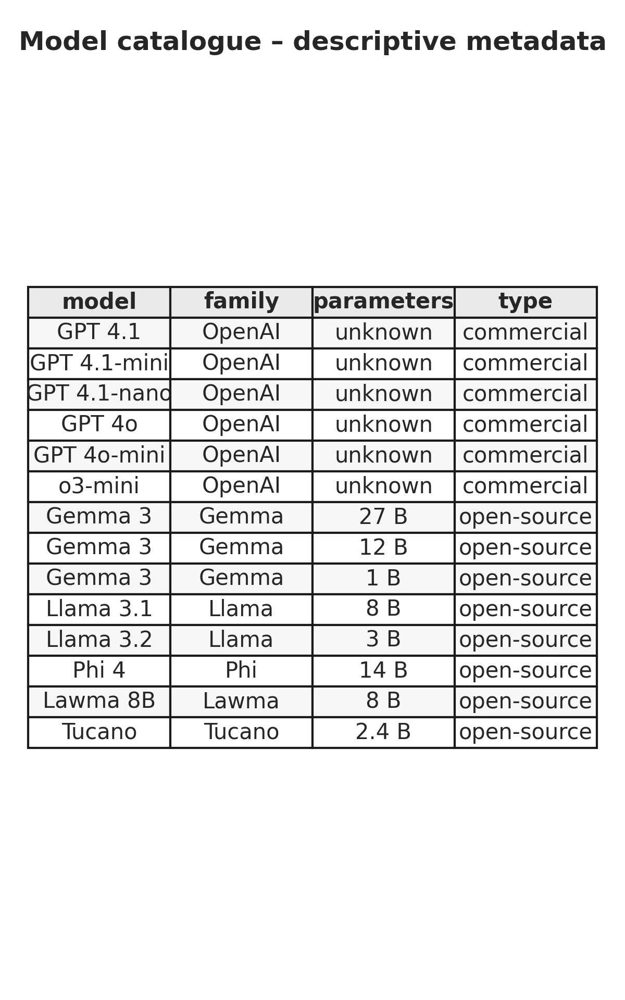
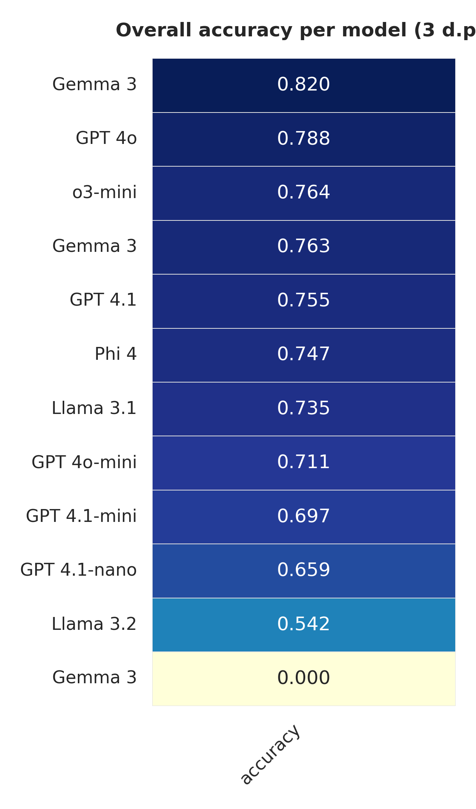
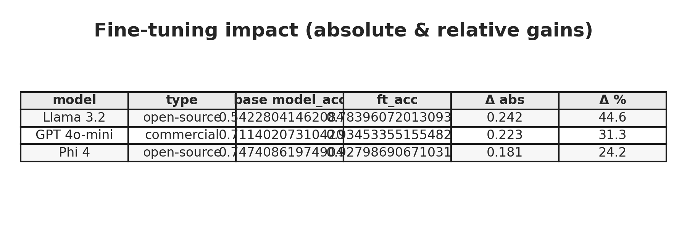

---
---

<!-- TODO: citation on APA style -->

<!-- TODO: repo https://github.com/rfdornelles/hertie_mds_master_thesis/ -->

<!-- TODO: statement of autorship -->

<!-- TODO: statement of AI -->

<!-- TODO: credit Steve Kerr https://github.com/smkerr/mpox-wiki-analysis/tree/main/7-paper/LaTeX%20template https://github.com/tecosaur/BMC -->

```{=latex}
\begin{titlepage}
    \centering
    \includegraphics[width=0.75\textwidth]{images/hertie-school-logo.jpg}
    \vspace*{\fill}
    
    \textbf{Jurimetrics in the Age of LLMs: Deploying Open‑Source Language Models for Empirical Insights into Brazilian Courts}\\

    \vspace{2.5cm}

    Rodrigo Filippi Dornelles

    \vspace{1cm}
    
    Master of Data Science for Public Policy, Class of 2025\\
    
    \vspace{0.5cm}

    Berlin, April 28, 2025\\

    \vspace*{\fill}

    Supervised by Prof. Lynn Kaack, PhD
    \vspace{0.5cm}
    
    Word count: 7,000 words

\end{titlepage}
```

<!-- TODO: add word count -->

```{=latex}
\newpage

\thispagestyle{empty}
\vspace*{\fill}
\noindent\hspace*{\fill}
\begin{minipage}{0.60\textwidth} 
\flushright 
\setstretch{1} 
\textit{\fontsize{10}{12}\selectfont"I promise to practice law with dignity and independence, to observe ethics, professional duties and prerogatives and to defend the Constitution, the legal order of the Democratic State, human rights, social justice, the proper application of laws, the rapid administration of justice and \textbf{the improvement of legal culture and institutions}."\\[1ex]
(Oath of the Legal Profession)\footnote{Art. 20, General Regulation of the Statute of the Lawyer Professorship, Brazilian Bar Association}
}
\end{minipage}
\vspace*{0pt}

\newpage
\tableofcontents
\thispagestyle{empty}


\setcounter{page}{1}

\newpage
```

<!-- TODO: melhorar o alinhamento da epígrafe -->

```{r}
# load datasets
lacerda_example <- readxl::read_excel('../../data/hidden/lacerda/dados_sentencas_limpo_v2 (com resultados).xlsx')
accuracy_metadata <- readr::read_csv("../../evaluate_results/accuracy_metadata.csv")
df_tasks_metrics_accuracy <- readr::read_csv("../../evaluate_results/tasks_metrics_accuracy.csv") |> 
  dplyr::left_join(accuracy_metadata) 

# helpers
ft_experiments <- c("3_open_ai_test_4o-mini",
        "7_open_ai_test_ft_4o_mini",
        "phi4_14b_baseline_unsloth",
        "phi4_14b_finetune_unsloth",
        "llama_3.2_3b_baseline",
        "llama_3.2_3B_ft_unsloth_2025-04-13_17-52-07")

```

# Executive Summary

<!-- 1 page -->

Lorem ipsum dolor

# Introduction

<!--

-   context:
    -   law is a fundamental aspect in governance and, therefore, to well being
    -   however, law is heavely dogmatic and there is little empirical legal research in the country.
    -   to do empirical research on law the data mining process is specially complicated, not because the lack of material -- Judiciary in BR is full digitalized -- but to analyze a large volume of data, with it's specific linguo
    -   the first obstacle to a data-driving analysis in law is how to manage text data in large scale and extract structured information from it: one could easily take months to properly analyze few dozens of complex documents.
    -   one side-hipothesis: our legal studies and legislative production is suboptimal, due the lack of evidence based decisions
    -   relevant to a policy school; in a data science program it's specially relevant to point out solutions to improve this field and offer policy recommendations in the light of the state of the art
-   contribution: pipeline, analyse, at least 1 os model trained

-->

-   **The lack of legal empirical research:** In Brazil, empirical legal research remains limited. However, it has recently become increasingly common to find studies based on this approach as demonstrated by @cabrera_de_bonito_pesquisa_2025.

-   **SOTA of legal research**: Those studies, however, still use little data from lawsuits and judicial precedents. Some of them use more qualitative/observational methods. In order to achieve a deeper and broader analysis, it is necessary to have a high level of financial resources and a big and highly qualified research team. Examples of outstanding and important empirical research that showed the relevance of this staff: @associacao_brasileira_de_jurimetria_avaliacao_2019, @costa_eficacia_2011, @instituto_de_pesquisa_economica_aplicada_ipea_perfil_2023.

-   **Exploratory legal data analysis**: It is possible to analyze the metadata of legal cases. Doing this would be helpful for exploratory analysis and formulating a hypothesis. Data from lawsuits are also used, as some examples show. In @dornelles_o_2021, data extracted from the Brazilian Supreme Court were used to describe the volume of new actions in the Court during Bolsonaro's administration:

{#fig-evolution width="600px"}

-   **Robust research**: More legal research beyond metadata is needed. To do that, complex documents must be analyzed in depth. Those documents are often relatively large and full of legal jargon, meaning that legal specialists must also do the analysis or at least oversee it.

-   **Natural Language Processing**: NLP is an important tool for handling text as data and providing valuable insights from text documents. However, NLP models often specialize in a single task @vajjala_practical_2020, while a handful of tools are necessary to extract information from such documents. Besides that, the traditional NLP models have little ability to understand larger contexts and follow specific instructions @raschka_build_2024, so large language models would be a better approach to that.[\^Although there is some debate around Small Language Models and Large Language Models, this distinction is not being made here. See also @chen_empowering_2025].

-   **Opportunity**: The advent of powerful language models plus the high level of digitization of Brazil's Judiciary branch would allow a new era of empirical research, both from the academic and the practitioner's perspective. It would be possible for a single researcher to study how administrative misconduct law cases were decided in the last few years. Also, it would be possible for a Public Defender to study Local Court decisions to establish a better strategy for new cases.

-   **This research**: It aims to understand if and how large language models could be used to leverage legal research by processing judicial decisions and extracting the features of interest. Moreover, the interest is in understanding the feasibility of using open-source large language models in real-world settings.

-   **Open-source models**: In academia, in public service, and similar use cases, privacy and costs are limited. Although the terms of use of commercial LLMs suggest a relative degree of confidence about data protection, once inserted in the API, there is no real control over it. Also, commercial models might be expensive (although cheaper than the fair price of human labor to do a similar task), which might block their deployment.

<!-- LLM as a way towards jurimetrics-->

<!-- 
  * context:
    - law is a fundamental aspect in governance and, therefore, to well being
    - however, law is heavely dogmatic and there is little empirical legal research in the country. 
    - to do empirical research on law the data mining process is specially complicated, not because the lack of material -- Judiciary in BR is full digitalized -- but to analyze a large volume of data, with it's specific linguo
    - the first obstacle to a data-driving analysis in law is how to manage text data in large scale and extract structured information from it: one could easily take months to properly analyze few dozens of complex documents. 
    - one side-hipothesis: our legal studies and legislative production is suboptimal, due the lack of evidence based decisions
    - relevant to a policy school; in a data science program it's specially relevant to point out solutions to improve this field and offer policy recommendations in the light of the state of the art
  * research gap: lack of empirical legal research in Brazil; very few studies based on empirical research but, when they happen, they may high impact
  * research opportunity: natural language processing, specially the advent of LLMs
  * RQ: is possible to deploy LLMs to analyze legal documents and extract structured information from they? and -- assuming that academia and public service would refrain using commercial models -- are open source models a feasible tool?
  * contribution: pipeline, analyse, at least 1 os model trained
  * literature: lawma, tucano, marina lacerda, rayssa, abj drogas, 
  * method:
    - gathered data from judicial sentences in São Paulo
    - received access from dataset from Lacerda: ± 400 judicial sentences labelled
    - cleaned data
    - prompt engeneering
    - used commercial OS (OpenAI) as baseline
    - tryied the OS models
      - llama
      - gemma
      - tucano
      - lawma
      - lola
    - libraries HF and unsloth
    - ft models
    - compared their performance
    - limitations: 
      - drug traffic, sao paulo
      - 2017/2018
      - only models that were possible to access
      - small sample to ft and test
      - tucano, lawma:
        - context window was too short to legal docs;
        - tried with no success to apply rope scaling or yarn
        - tried RAG to retrieve relevant parts; tried rag to squish the text
        - possibility: try a task-based prompt -- still limited window, but might be sufficient to many documents
        - lack of computational resources
  * results
      - os: 
        - cons: difficult to manage, several have short context window; computationaly intensive;
        - pro: privacy; costs; fast paced; adaptability; full control;
      - comercial:
        - cons: privacy; costs; 
        - pro: reliability; easiness; credibility
      - indeed, specialization is a good strategy
      - have good potential, altough more testing is needed 
    - future research:
      - quantization; prunning; distillation;
      - task-based approach
    - policy recs:
      - academia: open the data from the empirical studies -\-\-> corpus of legal label
      - os community: larger context windows, more light models
      - judiciary branch: improve metadata recollection and open access to judicial decisoms
    
    * conclusions:
      - llms are good tools to leverage empirical legal research in BR
      - commercial models: still up to date a good strategy, despite of its costs and privacy issues
        - pre-process to anonymize is an option
      - os models: feasible and decent baseline performances in certain models; ft is a good strategy that increases a lot performance

    
-->

# Literature Review

-   **Brazilian legal research landscape**: @alves_da_silva_aspectos_2022, @cabrera_de_bonito_pesquisa_2025
-   **LLMs applied to legal field**: @junior_juru_2024, @katz_natural_2023, @bertalan_predicting_nodate
-   **LLMs in Portuguese**: @niklaus_multilegalpile_2023, @almeida_sabia-2_2024, @pires_sabia_2023
-   **Specialization in Legal Tasks**: This is the paper that most gave actionable inputs to this research: @dominguez-olmedo_lawma_2024
<!--
@alves_da_silva_aspectos_2022 paulo: 'O que se entende por pesquisa empírica em direito? A pesquisa empírica em direito é uma pesquisa que toma por objeto não exclusivamente leis e normas, mas principalmente o fenômeno jurídico em sua manifestação concreta' Não olha somente a lei posta, positivada, mas os modos como a lei atua na vida das pessoas e no funcionamento das instituições. A pesquisa empírica em direito, em resumo, analisa o fenômeno jurídico em um sentido mais amplo do que normalmente se lhe atribui na dinâmica de suas manifestações concretas.

Sob tais características, o nosso padrão de produção de conhecimento em direito é predominantemente bibliográfico, baseado em “livros” - em sentido amplo: livros, artigos, opiniões doutrinárias, manuais etc. O jurista é formado para ler e interpretar textos escritos, insculpidos em obras bibliográficas. Desde a faculdade, aprendemos a decifrar uma linguagem rebuscada que veicula um conjunto vasto de conceitos, significados e opiniões e, então, articulá-los em discursos lógicos de função retórica. Se na formação de nível médio aprendemos a decorar e repetir, nas faculdades de direito aprendemos a decifrar e a discorrer

--->

@alves_da_silva_aspectos_2022 paulo: "What is meant by empirical legal research? Empirical legal research is a study that focuses not exclusively on laws and regulations, but primarily on the legal phenomenon in its concrete manifestation. It does not examine only the enacted, positivized law, but also the ways in which the law operates in people's lives and in the functioning of institutions. In short, empirical legal research analyzes the legal phenomenon in a broader sense than is typically attributed to it in the dynamics of its concrete manifestations.

Under these characteristics, our standard of knowledge production in law is predominantly bibliographical, based on 'books' — in a broad sense: books, articles, doctrinal opinions, manuals, etc. The legal scholar is trained to read and interpret written texts embedded in bibliographic works. From law school, we learn to decipher an ornate language that conveys a vast array of concepts, meanings, and opinions, and then to articulate them into logically structured, rhetorical discourse. While in secondary education we learn to memorize and repeat, in law school we learn to decipher and discuss."

<!-- bib review: @cabrera_de_bonito_pesquisa_2025 "Embora haja muitas abordagens que tentam lidar com o desafio de transformar textos legais em um conjunto de condições legíveis por máquina, os resultados ainda são insatisfatórios e esse continua sendo um grande desafio em aberto (Dragoni et al., 2016). A pesquisa nas áreas de extração de informações (processamento de linguagem natural, inteligência artificial, entre outros) aumentou o processo de mineração de texto para aprimorar o processo de descoberta de conhecimento neste domínio (Wagh, 2013)" ""Uma das aplicações de métodos quantitativos ao Direito, em especial, à jurisprudência, é cunhada como jurimetria. O uso dessa ferramenta não é contemporâneo, mas pouco explorada em países de tradição jurídica romano-germânica, como o Brasil. Isso porque háum distanciamento entre pesquisadores de ciências de campos científicos diferentes, aplicando-se aos voltados à análise das ciências jurídicas, cuja abordagem quantitativa dos estudos não é frequente (Andrade, 2018)"

-->


@cabrera_de_bonito_pesquisa_2025 "Although there are many approaches that attempt to tackle the challenge of transforming legal texts into a set of machine-readable conditions, the results remain unsatisfactory, and this continues to be a major open challenge (Dragoni et al., 2016). Research in the fields of information extraction (natural language processing, artificial intelligence, among others) has advanced the text mining process to enhance the discovery of knowledge in this domain." "One of the applications of quantitative methods in Law, particularly in jurisprudence, is known as jurimetrics. The use of this tool is not a contemporary phenomenon, but it is little explored in countries with a Roman-Germanic legal tradition, such as Brazil. This is because there exists a gap between researchers from different scientific fields and those focused on the analysis of legal studies, where a quantitative approach is not frequently employed.(Andrade, 2018)" 

<!-- --- jurimetria (18/04): 2 270 --- jurimetrics (18/04): 21 800 --->
<!--jurimetria @ribeiro_jurimetria_2022 A utilização da estatística aplicada ao direito, embora ainda incipiente no Brasil, já chama a atenção do direito estadunidense há tempos. Para efeito de comparação, o termo jurimetria, quando pesquisado na ferramenta Google Scholar, conhecida por agregar artigos acadêmicos de várias fontes, resulta em 814 resultados (12. set.2021), ao passo que o termo jurimetrics pesquisado na mesma ferramenta retorna 16.600 resultados. Oliver Holmes Jr. (1897) já mencionava que o “homem das leis” do futuro seria aquele que dominasse a estatística e a economia.(“The Path of the Law”, 1897). Desde a década de 1960, o direito americano tem lidado com esse seu aspecto pouco conhecido8 . Entretanto, as possibilidades surgidas com a evolução da informática levaram a jurimetria e a predição probabilística no direito a outro patamar.

Está em curso, no Brasil, uma grande revolução tecnológica no judiciário. Os processos passam por uma fase de informatização e digitalização e o Processo Judicial Eletrônico traz, por um lado, desafios aos advogados que precisaram forçosamente renovar e reaprender a peticionar no ambiente digital e, por outro, ao próprio Judiciário, na implementação de sistemas seguros e coesos. Apesar de atualmente todos os processos serem digitais, ainda falta muito para a uniformização dos dados, o que dificulta a pesquisa, principalmente quantitativa, com eles. Um exemplo básico: os números de processos deveriam ser uniformes em todos os ramos da justiça e em todo o Brasil, conforme as determinações da Resolução do CNJ nº 65/2008. Porém, ainda se encontram processos em curso que não seguem essa regra, dificultando o rastreamento de processos -->

<!-- Translation to English -->
jurimetrics @ribeiro_jurimetria_2022 The application of statistics to law, although still in its early stages in Brazil, has long attracted the attention of American legal circles. For comparison purposes, the term "jurimetria" when searched on Google Scholar —a tool known for aggregating academic articles from various sources— yields 814 results (as of September 12, 2021), whereas the term "jurimetrics" returns 16,600 results when searched on the same tool. Oliver Holmes Jr. (1897) already mentioned that the "lawman" of the future would be one who mastered statistics and economics ("The Path of the Law", 1897). Since the 1960s, American law has been dealing with this little-known aspect. However, advances in computing have taken jurimetrics and probabilistic prediction in law to a whole new level.

There is currently a major technological revolution underway in the Brazilian judiciary. Cases are undergoing a phase of computerization and digitization, and the Electronic Judicial Process presents, on the one hand, challenges for lawyers who have been forced to update and relearn how to file petitions in a digital environment and, on the other hand, challenges for the Judiciary itself in implementing secure and cohesive systems. Although all cases are now digital, much work remains to achieve data uniformity, which makes research—especially quantitative research—more difficult. A basic example: case numbers should be standardized across all branches of the judiciary throughout Brazil, in accordance with the determinations of CNJ Resolution No. 65/2008. However, there are still ongoing cases that do not follow this rule, hindering the tracking of cases.

-   literature: lawma, tucano, marina lacerda, rayssa, abj drogas @dominguez-olmedo_lawma_2024, @correa_tucano_2024, @lacerda_e_silva_punindo_2021, @instituto_de_pesquisa_economica_aplicada_ipea_perfil_2023, @associacao_brasileira_de_jurimetria_avaliacao_2019, @costa_eficacia_2011, @benatti_gender_2024

The primary focus is the lack of empirical research in the legal field and the costly, time-consuming nature of conducting such studies. While traditional legal research, like that of the Brazilian Applied Economics Institute, and jurimetrics research using data-driven techniques exist, they are limited. In contrast, recent advancements in the application of LLMs to the legal field in the U.S. (e.g., Dominguez-Olmedo et al., Lawma: The Power of Specialization for Legal Tasks) show promise. My thesis will explore the role of open-source models, techniques for their specialization in legal tasks, and the costs of their deployment.

"The cost of human annotators represents a considerable bottleneck for the field of empirical legal studies. In many scientific disciplines, the advent of low-cost and flexible tools for data extraction can lead to tremendous boosts in scholarly productivity and knowledge production" @dominguez-olmedo_lawma_2024

"Lightly fine-tuned special purpose models achieve significantly higher accuracy from relatively few labeled examples. Labeling a few hundred cases is often financially feasible. This suggests a simple and practical strategy for solving legal classification tasks: Obtain a few hundred labeled examples, fine-tune an open source model, and use the fine-tuned model to annotate the remaining cases." @dominguez-olmedo_lawma_2024

# Research Question

Can open-source large language models be deployed in the Brazilian legal context to accurately extract information, recognize entities, and summarize complex legal documents?

At one hand, we recognize a research gap regarding the lack of empirical legal research mainly in Brazil. On the other hand, we see an opportunity to apply the findings of the fast-paced field of natural language processing, empowered by the modern technichs from deep learning. Giving this setting, the research questions relies on: 1. How can large language models be deployed in the Brazilian legal context to accurately extract information, recognize entities, and summarize complex legal documents, considering factors such as cost, computational efficiency, and the specific challenges of legal language and document structure?

This question implies: - is possible to use commercial llms in similar tasks - the new releases on open-source models might reached a point when those are also a <empolgante> perspective

```{=html}
<!-- * research gap: lack of empirical legal research in Brazil; very few studies based on empirical research but, when they happen, they may high impact
  * research opportunity: natural language processing, specially the advent of LLMs
  * RQ: is possible to deploy LLMs to analyze legal documents and extract structured information from they? and -- assuming that academia and public service would refrain using commercial models -- are open source models a feasible tool?
  -->
```

# Teorethical Framework

-   **Natural Language Processing**

-   **LLMs**

-   **Fine tuning**: Using @dominguez-olmedo_lawma_2024 strategy.

-   **LoRA**: @daniel_han_unsloth_2023

-   I'm assuming that the the main contribution would be in the first stage of the data science cicle @wickham_r_2023

    ![Data science cicle [@wickham_r_2023]](images/r4ds_data_science_cicle.png){.Fig width="624"}

-   NLP: @vajjala_practical_2020: tasks such as "text classification, information extraction, information retrieval, conversational agent, text summarization, question anserwing, machine translation"

    !['NLP tasks organized according to their relative difficulty' [@vajjala_practical_2020]](images/vajjala-2020_nlp_complexity.png){width="441"}

-   LLMs: 'ushered in a new era for natural language processing (NLP)'; "are deep neural networks models; developed over the past few years", 'NLP models performed well in many tasks' -- they focused on specific tasks; 'failed on follow complex instructions, contextual analysis and creating coherent and contextually appropriate original text'. @raschka_build_2024

-   chose sota models, both commercial and open source

-   gathered data, cleaned and adapted: @lacerda_e_silva_punindo_2021

-   design a prompt to extract the same features, according with Lacerda e Silva's dictionary. prompting relies on the ability of the model 'understand' specific instructions and act accordingly. So with several iterations, it was possible to guide the model on how to perform the task

-   run models

-   fine tuned

-   test again

-   deep dive in the results

\* method: - gathered data from judicial sentences in São Paulo - received access from dataset from Lacerda: ± 400 judicial sentences labelled - cleaned data - prompt engeneering - used commercial OS (OpenAI) as baseline - tryied the OS models - llama - gemma - tucano - lawma - lola - libraries HF and unsloth - ft models - compared their performance - limitations: - drug traffic, sao paulo - 2017/2018 - only models that were possible to access - small sample to ft and test - tucano, lawma: - context window was too short to legal docs; - tried with no success to apply rope scaling or yarn - tried RAG to retrieve relevant parts; tried rag to squish the text - possibility: try a task-based prompt -- still limited window, but might be sufficient to many documents - lack of computational resources

## Data Sources

To evaluate LLMs it was necessary to have text from judicial decisions in a reasonable amount to be splitted in train, test and validation. Instead of annotating new data, this research followed the assumption from @dominguez-olmedo_lawma_2024 in which 

-   **Lacerda Dataset**: @lacerda_e_silva_punindo_2021 A comprehensive empirical analysis was conducted on over 400 legal cases related to drug trafficking. The researcher collected these cases from the São Paulo State Court of Justice (TJSP), focusing on a sample that covered the years 2017 and 2018. Approximately 35 features were manually annotated and labeled for each case. Access to the dataset was obtained by contacting the researcher, who provided it for further adaptation to meet the specific requirements of this research. Some of the original features also referred to other documents rather than the judicial decision, and, therefore, they were excluded (since it would not be reasonable that the model inferred that). Features related to biological data were also excluded for ethical reasons.

Also, I have tried to access @instituto_de_pesquisa_economica_aplicada_ipea_perfil_2023 micro data to build a golden dataset since they have about 3.5k data points labelled. I have filled a freedom of information request and, although it was possible to access the [general dataset](https://www.gov.br/mj/pt-br/assuntos/sua-protecao/politicas-sobre-drogas/pesquisa-e-informacao-3/pesquisa%20IPEA/pesquisa-ipea-perfil-processado-e-producao-de-provas), they have not provided the lawsuit identifier, so it was not possible to match each row in their dataset to a legal case and, therefore, to a specific document.

-   **Judicial Decisions**: The documents relative to each decision case analyzed by the Lacerda Dataset were extracted automatically from the TJSP website. Since there is no API to that, the process was done using @filho_coleta_2020 package called {tjsp}. It gathered metadata of each case and the decision in string format in an R data frame. Some cases were collected by its .pdf files and read automatically.

-   **Final dataset**: After cleaning, some duplications were excluded, and some documents were not collected; the final result was a dataset with 258 cases. Also, the final dataset contained 50 columns, which was due to some categorical features being transformed into a boolean. For instance, the column *DenDrogas* contained information about the most common articles of Law in the accusation. It was transformed into the columns *denuncia_art_33*, *denuncia_art_34*, and *denuncia_art_35*.

-   data from legal experts -- @lacerda_e_silva_punindo_2021

<!--TODO: describe the tasks -->

## Methods

-- different tasks, that's why NLP technichs were not feasible -- @vajjala_practical_2020: "Recently, large transformers have been used for transfer learning with smaller down‐stream tasks. Transfer learning is a technique in AI where the knowledge gained while solving one problem is applied to a different but related problem. With transformers, the idea is to train a very large transformer mode in an unsupervised manner (known as pre-training) to predict a part of a sentence given the rest of the content so that it can encode the high-level nuances of the language in it. " --\> pick some basemodel and use it to the specific task

-- not enought to have an answer, it should be an structured output: JSON. force the output to match a json-style was a challenge, which were overcome with @chase_langchain_2022. commercial models are better on this, and do this with the open-source was a challenge

-- context window: at least 16k is needed; <list context window of the open source models> were insufficient. tryied rope-scaling and yarn but lacked computational resources. @daniel_han_unsloth_2023 was a good and functional option, but it only worked with newer infrastructure.

-- @raschka_build_2024, Lora 
-- @daniel_han_unsloth_2023 enabled using the models

We used 12 models in this research. OpenAI models were considered commercial, and the others were open source. Also, OpenAI does not disclose its architectures, so it is impossible to know its number of parameters beforehand.

-   etl
-   prompt engeneenering, build schema
-   generation in OpenAI's models
-   evaluation pipeline
-   generation with commercial models
    -   window context: rope scaling, yarn, rag, chuncking
    -   structured output
    -   base model generation
-   finetune commercial and open source models
    -   OpenAI's API
    -   Unsloth
      - ft details
-   final evaluation

```{r}
#| label: tbl-metadata
#| tbl-cap: "Basemodels used"
readr::read_csv('../../evaluate_results/model_metadata.csv') |> knitr::kable() |>  kableExtra::kable_paper()

```

## Limitations

-- little samples, altough high quality -- only used one field of law, only São Paulo -- prompt very large -- might be some overfitting --

# Results

<!--TODO: explain the evaluation metric -->

<!--TODO: change the tasks from data type to NLP task (extraction, question answering, NER) -->

{width="100%"}

bla bla



bla bla



After 17 experiments[^1], the metrics above regarding accuracy were gathered. By accuracy, we are considering the proportion of exact answers relative to the total answers. Below, we can see the performance of the base models before fine-tuning.

[^1]: Ignoring validation tests and the experiences to try to overcome the limitations regarding context windows. Also, in this count there were the fine tune.

```{r}
#| label: tbl-accuracy-metadata
#| tbl-cap: "Accuracy of base models"
 accuracy_metadata |> 
  dplyr::filter(status == "base model") |>
  dplyr::select(family, type, model, parameters, accuracy) |> 
  dplyr::mutate(accuracy = round(accuracy, digits = 4)) |> 
  dplyr::arrange(-accuracy) |> 
  knitr::kable() |> kableExtra::kable_paper(lightable_options = "striped")
```

The model Gemma 3-1B achieved 0.0 accuracy due to its inability to yield valid structured JSON output and because in many cases the answers were only repeating the schema's example.

The model that best performed in a zero-shot approach was the Gemma 3-27B parameters, which, surprisingly, also beat the benchmark commercial models, even GPT-4o. Also, the Gemma 3 family likely yields accurate results since the lighter version with the 12B parameter performed very well and was better than the newly released GPT-4.1. The model Phi-4 also performed very well, betting OpenAI's smaller models. Regarding the Llama family, the 3.1 version performed better than the 4o-mini and the smaller GPT 4.1-mini and GPT 4.1-nano. On the other hand, Llama 3.2 had a bad performance.

Trying to understand a more fine-grained analysis, breaking the results by the kind of tasks was possible. The *numeric* tasks are those related to extracting and calculating the amount of drugs or prison time in months: those tasks involved not only recognizing the numbers (entities) but also 'calculating' the final value. The *boolean* tasks are generally in the realm of question answering in a TRUE/FALSE/None style (for instance, if art. 33 was the basis of the sentence or if there were confessions by the defendant). The *categorical* tasks are those closely related to classification tasks, such as the case's outcome (conviction, acquittal, etc.). The *open textual* tasks are more likely to be similar to named entity recognition: the name of the Judge and the defendant in this case.

{#fig-base_model}

We can see that the *open textual* tasks have a very high level of performance in nearly all models, while the *boolean* and *categorical* tasks were more diverse performance-wise. We can also see some differences in numeric tasks, but in general, they all performed very well.

<!--TODO: explain the columns, their task, show the number of tasks in each  --->

Those results suggested that continuing to work with open-source models was a promising strategy. So, fine-tuning was performed with the models OpenAI 4o-mini (which is the recommended model by OpenAI), Llama 3.2 (3B), and Phi4. No resources were available to perform fine-tuning on other models. After the fine-tuning, we could see a big improvement in the results.

{#fig-finetune}

The process of fine-tuning, even with a small dataset with 186 cases, highly improved the performance of the models, confirming the 'power of specialization' as suggested by @dominguez-olmedo_lawma_2024. As @fig-finetune showed, model Phi4 tied with GPT 4o-mini and the much smaller Llama 3.2 (3B) learned very easily, even with both models being trained with the same 10 epochs. With a richer dataset and/or more epochs, it would be possible to reach or even surpass GPT 4o-mini performance.

<!--TODO: add data from the training -->

```{r}
#| label: tbl-finetune-delta
#| tbl-cap: "Fine tuned models: change in accuracy (absolute value Δ and relative value %)"
df_tasks_metrics_accuracy |> 
  dplyr::filter(experiment %in% ft_experiments) |> 
  dplyr::select(-experiment, -accuracy, -type, -family, -parameters) |> 
  dplyr::relocate(model, status) |> 
  dplyr::arrange(model, status) |> 
  dplyr::mutate(
    status = stringr::str_replace(status, "base model", "basemodel")) |>
  tidyr::pivot_wider(
    names_from = status,
    values_from = c(overall_accuracy, boolean, categorical, numeric, open_textual),
    names_sep = "_"
  ) |>
  dplyr::mutate(
  #   `Δ accuracy` = overall_accuracy_finetuned - overall_accuracy_basemodel,
  #   `Δ_boolean` = boolean_finetuned - boolean_basemodel,
  #   `Δ_categorical` = categorical_finetuned - categorical_basemodel,
  #   `Δ_numeric` = numeric_finetuned - numeric_basemodel,
  #   `Δ open textual` = open_textual_finetuned - open_textual_basemodel
  # ) |>
     `Δ accuracy` = overall_accuracy_finetuned - overall_accuracy_basemodel,
    `% accuracy` = 100 * `Δ accuracy` / overall_accuracy_basemodel,
    
    `Δ boolean` = boolean_finetuned - boolean_basemodel,
    `% boolean` = 100 * `Δ boolean` / boolean_basemodel,
    
    `Δ categorical` = categorical_finetuned - categorical_basemodel,
    `% categorical` = 100 * `Δ categorical` / categorical_basemodel,
    
    `Δ numeric` = numeric_finetuned - numeric_basemodel,
    `% numeric` = 100 * `Δ numeric` / numeric_basemodel,
    
    `Δ open textual` = open_textual_finetuned - open_textual_basemodel,
    `% open textual` = 100 * `Δ open textual` / open_textual_basemodel,
    
    dplyr::across(.cols = where(is.numeric),
                  .fns = ~round(.x, digits = 2))
  ) |> 
  dplyr::select(-overall_accuracy_basemodel:-open_textual_finetuned) |> 
  tidyr::pivot_longer(
    cols = -model,
    names_to = "metric",
    values_to = "value"
  ) |> 
  tidyr::pivot_wider(
    names_from = model,
    values_from = value
  ) |> 
  knitr::kable() |> kableExtra::kable_paper(lightable_options = "striped")
```

As @tbl-finetune-delta shows, Llama 3.2(3B) had the most significant change in its performance, especially with the categorical tasks. Specifically, with this task, we could see a performance degradation of GPT 4o-mini. Phi4, [^2] though they had the second-best performance, learned less than Llama, which suggests a ceiling. Assuming that, in those architectures, the number of parameters is the critical factor, fewer parameters than 14B and more than 3B would be ideal.

[^2]: There is the [mini version of Phi-4](https://huggingface.co/microsoft/Phi-4-mini-instruct), however it was not possible to run or fine-tune it with the actual computational resources.

# Discussion

Lorem ipsum dolor sit amet, consectetur adipiscing elit

## Key Findings

-   results - os: - cons: difficult to manage, several have short context window; computationaly intensive; - pro: privacy; costs; fast paced; adaptability; full control; - comercial: - cons: privacy; costs; - pro: reliability; easiness; credibility - indeed, specialization is a good strategy - have good potential, altough more testing is needed

## Future Research

```         
- future research:
  - quantization; prunning; distillation;
  - task-based approach
```

## Policy Recommendations

-   Academia: Disclose data from empirical legal research as much as possible, as it would be a valuable resource for fine-tuning models. If IPEA released the data from @instituto_de_pesquisa_economica_aplicada_ipea_perfil_2023, would it be possible to achieve even better results.

-   Open source community: keep at least 128k context window standard and develop light open-source models. @wolf_transformers_2020 is a fundamental framework for training and inference. @daniel_han_unsloth_2023 was valuable in fine-tuning models efficiently.

-   Judiciary branch: should ensure that data and documents from lawsuits are available digitally for research while maintaining high standards of privacy. Anonymization would make this feasible.

-   Instituions interested in empirical legal research: OpenAI's API probably offers a better balance of ease and performance. However, open-source models have proven powerful for these tasks and might be deployed to accelerate empirical research in Law.

-   Law schools: invest in data literacy for legal students and practitioners.

## Conclusion

```         
* conclusions:
  - llms are good tools to leverage empirical legal research in BR
  - commercial models: still up to date a good strategy, despite of its costs and privacy issues
    - pre-process to anonymize is an option
  - os models: feasible and decent baseline performances in certain models; ft is a good strategy that increases a lot performance
```

@alva-manchego_suitability_2021

Lorem ipsum dolor sit amet, consectetur adipiscing elit.

# References

::: {#refs}
::: 
<!-- TODO: insert references.bib file here -->

<!--TODO: annex -->

```{=latex}
\clearpage
\appendix
```

```{r}
#| child: 'appendix_and_extra.qmd'

```

<!-- TODO: import content from other files -->