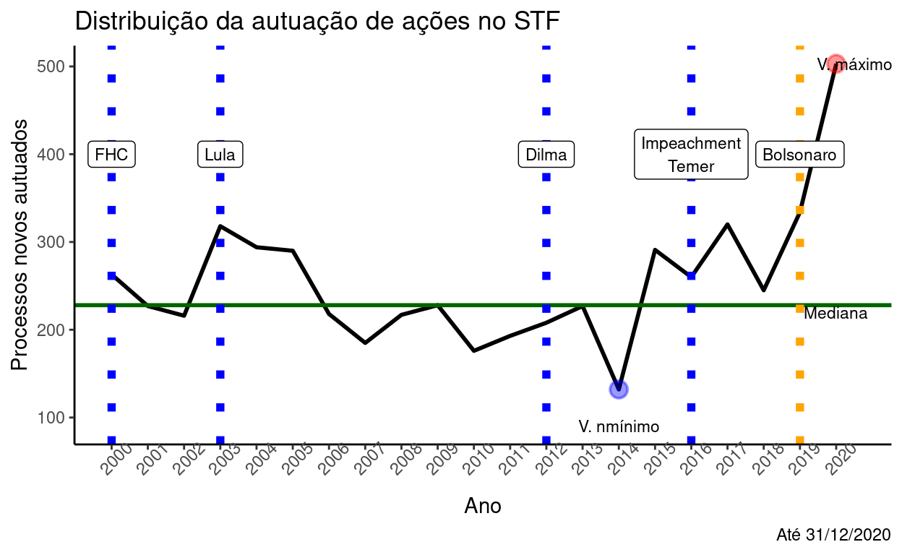

# Introduction

-   **The lack of legal empirical research:** Empirical legal research is still scarce, at least in Brazil. In the recent decades there were the idea of bringing a quantitative approach to Law, called jurimetrics @loevinger_jurimetricsnext_1948. Recently, it is becoming more commom to find studies based on empirical research as showed by @cabrera_de_bonito_pesquisa_2025.

-   **SOTA of legal research**: Those studies, however, still uses little data from lawsuits and judicial precedents. Some of them do more qualitative/observational methods. To do more deep and broad analysis it is necessary to have a high level of resourcers and big and higly qualified research team. Examples of very good and important empirical research showed the relevante of this staff: @associacao_brasileira_de_jurimetria_avaliacao_2019, @costa_eficacia_2011, @instituto_de_pesquisa_economica_aplicada_ipea_perfil_2023.

-   **Exploratory legal data analysis**: It is possible to simple analyze metadata of legal cases. Doing this would be usueful to exploratory analysis and to formulate hypoteshis. Data from lawsuits are also used as some examples shows. In @dornelles_o_2021 data extracted from the Brazilian Supreme Court were used to describe the volume of new actions in the Court during Bolsonaro's administration: .

-   **Robust research**: However, to do more legal research that goes beyond metadata. And, to do that, it is necessary to analyze complex documents in depth. Those documents are often relativetly large and full of legal jargon, meaning that is also necessary that legal specialists do the analysis or, at least, oversee it. 

-   **Natural Language Processing**: NLP is an important tool to handle text as data and to provide valuable insights from text documents. However, NLP models often are specialized in a single task @vajjala_practical_2020, while, to extract information from such documents it is necessary a handfull of tools. Besides that, the traditional NLP models have little ability to undertand larger contexts and to follow specific instructions @raschka_build_2024, so large language models would be a better approach to that. ^[Although there is some debate around Small Language Models and Large Language Models, this distinction is not being made here. See also @chen_empowering_2025].

-   **Opportunity**: The advent of powerful language models plus the high level of digitalization of the Judiciary branch in Brazil would allow to a new era of empirical research, both into the academic and the practioners perspective. It would be possible that a single researcher study how administrative misconduct law cases were decided and the last few years. Also, it would be possible to a Public Defender study Local Court's decisions in order to stablish better strategy to new cases.

-   **This research**: The aim is to understand if and how large language models could be used to leverage legal research by processing whole judicial decisions and extracting the features of interest. Moreover, the interest is about understanding the feasibility to use open-source large language model in real-world settings. 

-   **Open-source models**: In academia, in the public service and similar use cases, privacy and costs are a limitant concern. Altought the terms of use of commercial LLMs might suggest a relative degree of confidence about data protection, once inserted in the API there is no real control over it. Also, the commercial models might be expensive (altough cheaper than the fair price of human labor to do a similar task), which might be a block to its deployment.

# Research Question

# Data

# Methods

# Results

# Policy Recomendations

# References